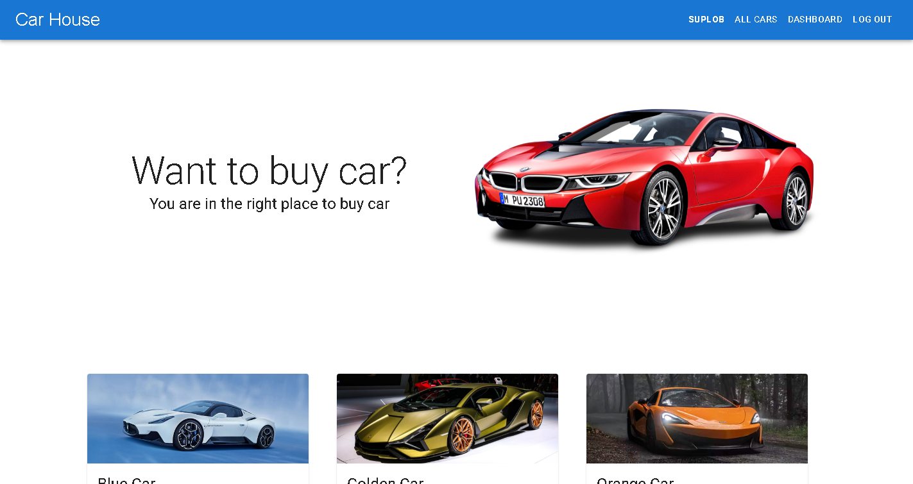
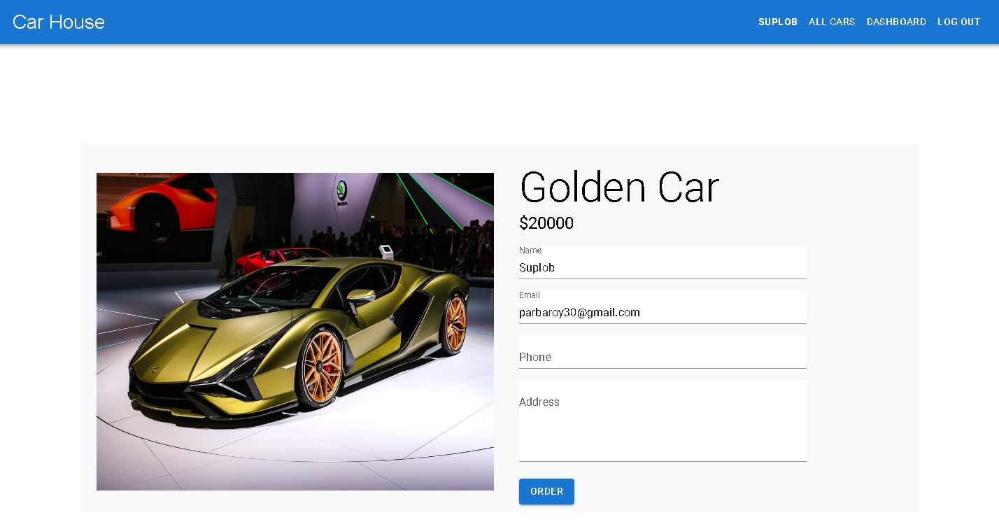
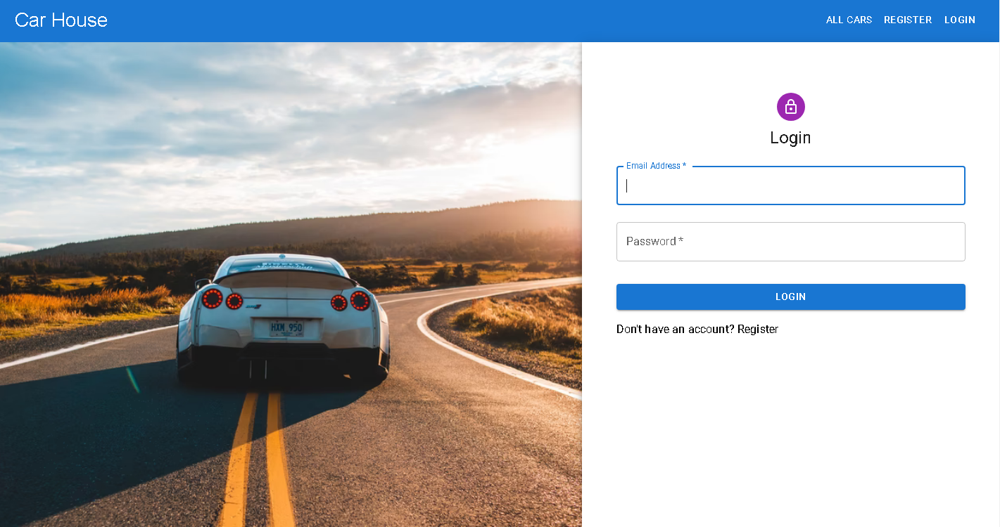
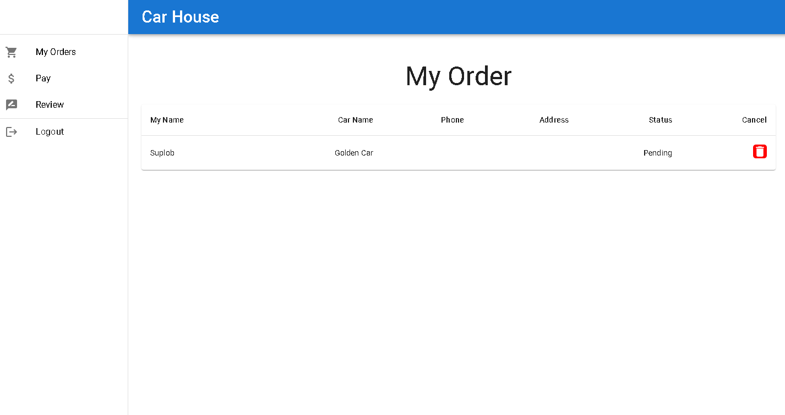
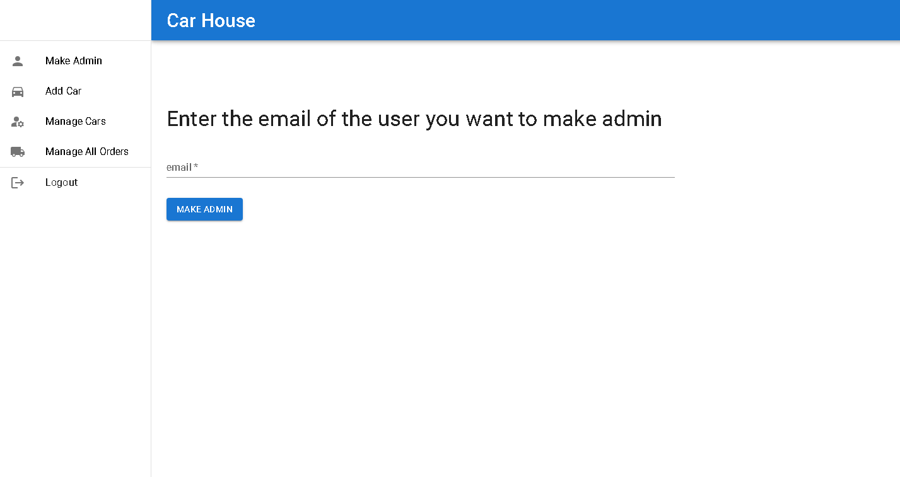

# Car House

Link to [live site](https://suplob-car-house.netlify.app/home)

Link to [backend code](https://github.com/Suplob/car-house-server)











This is a complete full stacked website made with ReactJS and MongoDB. CRUD operations are done in this project. Email password authentication done with firebase authentication.

## Tech Stack

- ReactJS
- React Router
- MaterialUI
- Firebase Authentication
- Netlify Hosting
- SwiperJS

## How to clone this repository

```
    git clone https://github.com/Suplob/car-house.git
    cd car-house
    npm i
```
